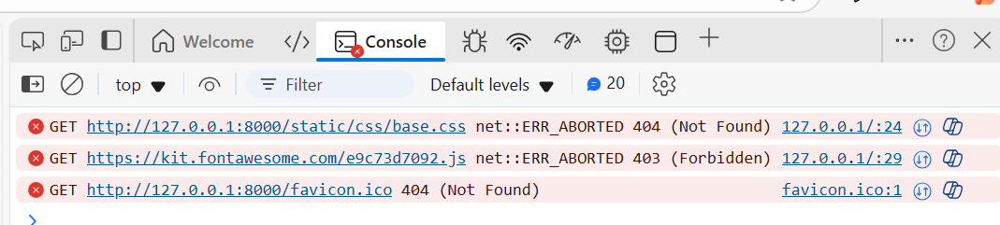

## Bugs

The bugs identified during the project

1. 
    - Issue 1: When inserting a icon in my base file, this was not visible on my screen. I opened the console and I saw some error messages.  
      
    
    - Solution: This issue got resolved by adding my personal fontawesome kit to the base file. 

2. 
    - Issue 2: CSS file not loading
    - Solution: I forgot to add the static files dir to the settings. Adding this to the setting solved the error 404 not found.

3. Adding the shopping bag was causing the error of url not found. The reason for this was that I added '/bag' to the urls.py file of the bag app and also added this to the project urls.py file. This caused the error that the browser was looking for a url /bag/bag which it could not find. After removing /bag from the urls.py bag app the issue got resolved.

4. Upon clicking on the substraction and addition button in the product detail page the shopping bag was being updated 

Solution: Adding the preventDefault function solved prevented that the data was automatically send to the backend
