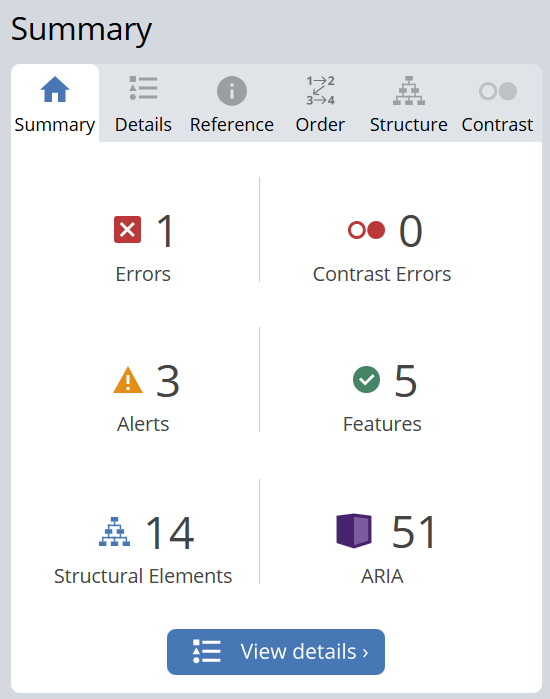
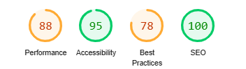
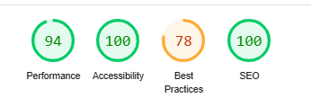

# Testing

## Bugs and Fixes During the Development Process

The bugs identified during the project

1. 
    - Issue 1: When inserting a icon in my base file, this was not visible on my screen. I opened the console and I saw some error messages.  

    - Solution: This issue got resolved by adding my personal fontawesome kit to the base file. 

2. 
    - Issue 2: CSS file not loading
    - Solution: I forgot to add the static files dir to the settings. Adding this to the setting solved the error 404 not found.

3. Adding the shopping bag was causing the error of url not found. The reason for this was that I added '/bag' to the urls.py file of the bag app and also added this to the project urls.py file. This caused the error that the browser was looking for a url /bag/bag which it could not find. After removing /bag from the urls.py bag app the issue got resolved.

4. Upon clicking on the substraction and addition button in the product detail page the shopping bag was being updated. Solution: Adding the preventDefault function solved prevented that the data was automatically send to the backend

5. While updating the product quantity in the bag and clicking on the save button the quantity would not be saved. I requested tutor support for this issue. Walking through this issue and adding some print statements, it appeared that the the function was recognising the button as an object instead of the form. Changing the function .prev to .closest helped solving this issue. 

6. Submitting the checkout form was causing the issue: fadeToggle() is not a function. After debugging it appeared that I was using a Jquery version that did not want to take this as a function. I changed it from minified version to the slim version. This solved the issue. 

7. After resolving the previous issue I encountered a follow up issue; The form was now being submitted and the data was send to Stripe. However, the response was being returned as none instead of HTTPResponse. After debugging I saw that I was missing a field - last name in mt view. After adding the view my issue got resolved.

8. Remove function in the bag was not working. Having a look at it it appeared that I added the remove in the type instead of the the class. Therefore the function was not being triggered.

9. In my shopping bag upon updating the quantity, input fields for all product would change. To solve this I requested tutor support. Looking at the walkthrough project, the support team advised me to make use of the function closest to only interact with the product. This solution worked out for me. 

10. Creating the wishlist model I created only one class for the wishlist. I worked on the feature adding the product to the wishlist. This worked all really well, untill I decided to work on the remove from wishlist function. I discovered, instead of adding the products to the wishlist, it was creating every time a new wishlist with a unique combination. I did some research and understood that I have to create two classes; One for the wishlist and one for the items with a relation between them. Upon changing the model, I came across many errors. It had some data save in my wishlist model, therefore it was not able take my changes. I deleted the older migration files and tried to do the rework, but it did not work. I had a talk with tutor support and with the following approach, I managed to delete all items in the wislist table. 
 - Run command: python manage.py dumpdata --exclude auth.permission --exclude contenttypes --exclude wishlist > db.json
 - Rename file db.sqlite3 to db.backup.sqlite3.
 - Run command: python manage.py migrate
 - Run command: python manage.py loaddata new.json
 
 This made sure that I had a backup before making changes as the the db.backup.sqlite3 file contains the previous data, with the broken wishlist data, your new dbs.qlite3 file contains all of your old data except for the wishlist data.

 11. Heroku deployment failed with the reason that there is no static root in the settings. By adding the static root in the settings the deployment went succesfull with all static and media files loaded.

 12. Deployment to Production via Heroku. I followed all deployment steps carefully and my site was configured correctly. With One issue that the bag was not loading in Production - I got a server error 500. Unfortunatelly, I was not able to see what exactly was going wrong, there I was advice to put the Debug to True and make a deployment to identify and solve the issues. After putting the debuug to True, it apeared that a the quantity_input_script.html template was not working correctly. The issue was that I used backslashes in the url instead of /. Changing this and deploying it back to production solved the issue. 
 
 13. I added the reviews model and I was trying to do the migrations. This was showing that there are no changes detected. I had to put the new app in the installed apps first to be able to make migrations.

 14. I made a deployment and afterwards I added the reviews model. This caused the issue that the production environment (Heroku) did not take the latest migrations. I had to run the migrate command in Heroku to solve this issue.

 15. I was not receiving confirmation email for order. This was because of a spelling mistake in the folder name.

 16. The searchbars were working fine on the smaller and larger screen, untill I opened the search on the smaller screen and made it larger; I had two searchbars! This was because I made the display for the larger searchbar hidden, but vice and versa I did not add the d-lg-none of the smaller search bar. I could solve it by adding the display to false.

 ## Testing using validators

### HTML

The validation was performed using the W3C Validator for HTML

* An error was identified due to a non-unique ID. This was addressed by updating one of the IDs to ensure uniqueness.
* Informative messages regarding trailing slashes on void elements were noted. These were left unchanged as they align with the existing template, and the Prettier extension would restore them if modified.

### CSS

The validation was performed using the W3C Validator for CSS

All CSS files were thoroughly reviewed through direct input, and no errors were detected.

  

### JSHint

One file was analyzed using JSHint, and the review flagged two issues:

* Missing Semicolon: This was identified and corrected, ensuring adherence to JavaScript syntax.

* Undefined Variable: JSHint flagged the Stripe variable as undefined, but this is a false positive. The Stripe variable is part of the initialization of the Stripe Elements widget, which is provided by a third-party API. Since it is essential for integrating Stripe functionality, the variable name remains unchanged.

  

### PEP8

Throughout my Python project, I used pep8 to identify and resolve errors like missing newlines, extra spaces, and exceeding character limits. While most issues were fixed, I left eight validations untouched as they pertained to the settings and 
env.py files containing sensitive secret keys.

### Wave 

#### Contrast issues

* Two were caused by Mailchimp asterisks. I have changed the color to text-light to resolve these two issues.
* Facebook text. This is a readonly span so I could have ignored it. To get around with the error I have change the text color to light.
* On the product page This come from the total amount of products shown. This includes class muted. I have chosen to keep it like this.
* For the wishlist heart icon and the text next to it. I had these classes as muted. I changed these to light to ensure this issue is gone.

#### Labelling issues

* First one was for the search on mobile. I have included a label for this
* Label for mailchimp missing. I have left this piece of code as it is as this is directly retrieved from mailchimp.
* For the product details page there was a missing label for the quantity input field. I have added this.

  

### Lighthouse

Lighthouse was utilized to evaluate the website across four key aspects: performance, accessibility, best practices, and SEO. The primary focus of this project was on accessibility and SEO, both of which achieved notably high scores.

Accessibility scored approximately 78% across all pages, with warnings arising due to the use of third-party elements such as Mailchimp and Stripe. After discussing this with my mentor, it was determined that these issues fall outside the scope of the project and can be left as they are. As this is common for all pages it will not be addressed anymore.

The picture shows errors in devtools. No errors were found in devtools - validated by my mentor.

  

Home:
For the desktop the three other aspects scored very high and there was no need to improve upon that at the moment.For the mobile version the performance score drops a bit.

  
  

Products: 
For the desktop version the score is again fine. For the mobile version score on performance is lower than expected. The reasons given for this are large content on the page. I have used next gen webp formatting already. Next step that I could do is to compress the images further.

  
  

Product detail Page:
For the desktop version performance, SEO and accesibility scored high. This performance was again lower on mobile version with the same reasons as mentioned in the products.

  
  

Shopping bag:
For the desktop version performance, SEO and accesibility scored high. This performance was again lower on mobile version with the same reasons as mentioned in the products.

  
 

Checkout:

For the desktop version performance, SEO and accesibility scored high. This was again lower on mobile version with the same reasons as mentioned in the products. Also an improvement here could put to change the fields color so it stands out. This was not causing any damage to the checkout functionality and the look was fine. I decided not make any changes to improve the score for now.

  
 

Add product:
For the desktop version performance, SEO and accesibility scored high. This performance was again lower on mobile version with the same reasons as mentioned in the products.

  
 

Profile:
For the desktop version SEO and accesibility scored high. Performance in both cases was lower to due large contents on the page..

  
 

 ## Manual testing

The purpose of this manual testing is to verify that all user stories for the specified milestones are functioning as expected. I clicked through each of the following pages— Home, Products, Product Details, Contact, Wishlist, Profile, and Product Admin, checkout - to ensure everything is working seamlessly.

### User stories check

#### Milestone 1: Viewing and Navigating

The site clearly conveys its purpose and offers intuitive navigation. Visitors can easily explore a paginated list of products, ordered by default or through various sorting options such as name, price, or category. Adding items to the cart works fine, with safeguards in place to prevent adding more than 99 or less than 0 items. For the future it would be nice to add a stock management system. It show the numbers of products in stock (this was out of scope).

|User Story ID| As an| I want to be able to| So that|Result|
|-------------|------|---------------------|--------|------|
|1.|Shopper|Browse a selection of products|I can make a purchase|Pass|
|2.|Shopper|See the details of each product|I can chose the right one to buy|Pass|
|3.|Shopper|I want to see the total price in my basket at all times|I can monitor my spending|Pass|
|4.|Shopper|Save items to a wishlist|I can revisit and purchase them later|Pass|
|5.|Shopper|Contact the store effortlessly|I can ask questions or seek assistance when needed|Pass|

#### Milestone 2: Registering and accessing account

|User Story ID| As an| I want to be able to| So that|Result|
|-------------|------|---------------------|--------|------|
|1.|Site User|Effortlessly sign up for an account|I can have a personal profile|Pass|
|2.|Site User|Conveniently log in or log out|I can access personal account information|Pass|
|3.|Site User|Login and logout option|Access my personal account details and securely logout|Pass|
|4.|Site User|Recover my password if I forget|I can regain access to the account|Pass|
|5.|Site User|Have a personalised user profile|I can view my order history, order cofirmations and save payment information|Pass|

#### Milestone 3: Filtering and sorting

|User Story ID| As an| I want to be able to| So that|Result|
|-------------|------|---------------------|--------|------|
|1.|Shopper|Easily see search results and the number of results|I can quickly decide if the desired product is available|Pass|
|2.|Shopper|Search for products by name or description|I can find specific items to buy|Pass|
|3.|Shopper|Sort the list of available products|I can identify the best rates, prices, and categories|Pass|

#### Milestone 4: Purchasing and checkout

|User Story ID| As an| I want to be able to| So that|Result|
|-------------|------|---------------------|--------|------|
|1.|Shopper|Easily select the quantity of a product when purchasing|I can buy the required amount of the product|Pass|
|2.|Shopper|view items in the shopping bag|identify the total cost and all items to be received|Pass|
|3.|Shopper|Modify the quantity of items in my shopping bag|I can effortlessly make adjustments before purchasing.|Pass|
|4.|Shopper|Receive an email summary of my order after checking out|I can maintain a record for future reference|Pass|
|5.|Shopper|Review my order history|I can track previous purchases at a glance|Pass|
|6.|Shopper|Submit my payment details securely|I get the guarantee the safety of my financial data|Pass|

#### Milestone 5: Adminstering and Managing products

|User Story ID| As an| I want to be able to| So that|Result|
|-------------|------|---------------------|--------|------|
|1.|Store Owner|Add new products to the store effortlessly|I can ensure the catalog stays fresh and relevant|Pass|
|2.|Store Owner|Modify existing product details|the information stays up-to-date|Pass|
|3.|Store Owner|Delete outdated or unavailable product|I can keep the store inventory organized and accurate|Pass|

#### Milestone 6: Product reviews
|User Story ID| As an| I want to be able to| So that|Result|
|-------------|------|---------------------|--------|------|
|1.|Shopper|Leave a review|I can share my experience for a product|Pass|
|2.|Shopper|Read reviews from other customers|I can understand the quality and value of a product|Pass|
|3.|Shopper|remove my previously submitted reviews|I can take down feedback that I no longer wish to display|Pass|

### Walkthrough

I successfully accessed the live site on multiple devices, including desktop and mobile. Everything displayed as expected, with all images and styles properly rendered, ensuring a consistent and polished experience across platforms.

#### Products Page

The Products Page enables seamless browsing. Features like:

* Search Results Display: Accurately shows the total number of matching items. A label is visible on the products page showcasing how many items are displayed.
* Search Bar: Locates products using keywords or descriptions. Testing has been done by entering different keywords from the name, desription and none existing ones. The results were comming out fine.
* Sorting Options: Efficiently filters results by name, category, and price. All sortings work.

#### Product Management for Admins

Admins can:

* Add Products via a simple form for product details (name, description, price, category, and image upload).
* Edit Products through a pre-populated form to ensure quick modifications.
* Delete Products via a button. To improve the user experience I would add a confirmation modal for the deletion in the future

CRUD operations were thoroughly tested and performed as expected. Only superusers can access these features and the buttons are only visible to them.

#### Product Details Page

A comprehensive page featuring:

* Product Overview: Includes details, pricing, and images.
* Reviews Tab: Users can read, add, and delete reviews (authenticated users only). Tested on one user can leave one review per product. The creator of the review can delete the review. Logged in with a second account and this was working fine as the delete button was not visible for the other user. It has been validated that a user can give a rating from 1-5 only. Future enhancement I would change the max amound characters for the message as this become very long.
* Wishlist Integration: Allows quick addition to the wishlist. The heart icon changes its color when added to the wishlist so that the user knows that it has been added. Checked in the database and the products are correctly being added.
* Admin Controls: Enables superusers to edit or remove products directly. The fields are being prepopulated with data and upon deletion the product is deleted. It is not visible for the user. Neither in the database. Tested by login in with different accounts. Other users can indeed not delete or edit the products.
* All sections were tested for usability and responsiveness.

#### Shopping Bag Page

Key features include:

* Overview: Displays product details, quantity, shipping cost and subtotal automatically calculated.
* Quantity Adjustment: Works via "+" and "-" buttons with an update function. I have tested to submit a number under the 0 or above 99. The validation is done that this is not possible. The update button updates the subtotals in the bag.
* Item Removal: Deletes products from the bag. Future development could be to add a modal for confirmation.
* Call-to-Actions: Supports continued shopping or checkout.
* Empty bag notifications were verified.

#### Checkout page

* Error Validation: All fields are validated to prevent incomplete or incorrect information during checkout.
* Tests verified the page's functionality, including secure payment submissions and accurate order summaries.
* Payment verfied on Stripe's dashboard.

#### Order Confirmation Page

* Displays confirmation message, order number, and details of the purchase summary.
* Sends email confirmation for reference.

Tested to ensure information displays correctly and aligns with purchase activity.

### Wishlist Page

* Allows adding products directly from the Product Details Page via the heart icon. Products are being added to the list.
* Enables management of saved items such as going back to the details page to make the purchase or delete the product from the wishlist.
* Personalization confirmed across sessions for logged-in users. A user can only see its own wishlist.

### Contact page

Features a straightforward form:

* Fields for Name, Email, Subject, and Message tested for proper validation and submission functionality. All tests confirmed smooth operation.

### Marketing

* Promotional Emails: A Mailchimp form is seamlessly integrated across all pages, capturing email addresses for storage in the Mailchimp database. This ensures a streamlined approach to launching campaigns for new products and offers.
* Social Media Presence: A dedicated Facebook page, linked perfectly in the footer with proper rel attributes, acts as a global window to promote business. The show now button was not available at moment of creation of the page, therefore I have added send a message as the call to action button.
* Search Engine Optimization (SEO): Strategic SEO practices are in place with meta descriptions, titles, and keywords for each page, complemented by a sitemap and robots.txt file, to boost visibility and attract more visitors.

From MoSCow perspective all Must and Should have features have been implemented. Due to time constraints the others were not picked up.

Must have:
* Full CRUD (Create, Read, Update, Delete) functionality. As an Admin it is possible to add new products, edit, read and delete new products. As a normal user it is possible to add, read and delete reviews. It is also possible to contact using the contact form.
* User login/register system. Django's build in authentication is used to enable this feature. It is possible to register, login, recreate the password if forgotten.
* Seamless checkout system. It is possible to checout securely using Stripe.
* User account profile management. Each user gets a profile assigned upon registering.
* Mailing list subscription. It is possible to subscribe for the newsletter using Mailchimp.
* Product sorting and searching capabilities. It is possible to sort the products on category, name and price. There is a search option for the products as well.
* Integration with Stripe for payments. The payments are getting through in Stripe. The dashboard on Stripe is showing all payments being initiated and being succesful.
* SEO-friendly language throughout the site. The SEO score is high throughout the website.
* Guest checkout option. It is possible to checkout as a guest. Tested it as a logged in user as well as logged out user.
* Order history for users. Users can login and view order history. Check has been done.
* Social media page integration. Facebook page has been created.
* Login in, registering and password recovery. It is possible to do a password recovery.
* Email confirmation for orders. An email is being received on placing order.
* User feedback for actions taken (toasts). Toasts messages are added throughout the website.
* Saved customer details during checkout. The tickbox has been reviewed. This is saving the information.

Should have:
* Product Reviews: Shoppers can rate and leave opinions. On each product detail page there is a section to leave reviews and read reviews of other users.
* Stock management interface for product management. It is possible as an admin to add new products, edit and delete.
* Contact Form: Facilitates user queries. A contact form is in place for all users to contact Smart Tech.
* Wishlist Feature: Allow users to save favorite items for future consideration. A wishlist is in place. Users can add products by clicking on the heart icon available on all product details pages.

Could-Have Feature
* Tech Insights Blog: Content that educates and excites.
* Product Demos: Videos showcasing key features.
* Related Recommendations: Suggest complementary items.
* Order Modifications: Editable orders until processing begins.
* Terms & Conditions: Clear policies for transparency.
* Delivery Information: Accessible details about shipping options.
* Coupon code for extra discount
* Special Offers

Won't have
* Currency Options: Support for multiple currencies.
* Third-Party Reviews: Trustpilot integration.
* Advanced Analytics: Sales report generation.

### Environment setup

I have created a seperate document for the environment setup [Environment Setup](ENVIRONMENTSETUP.md)